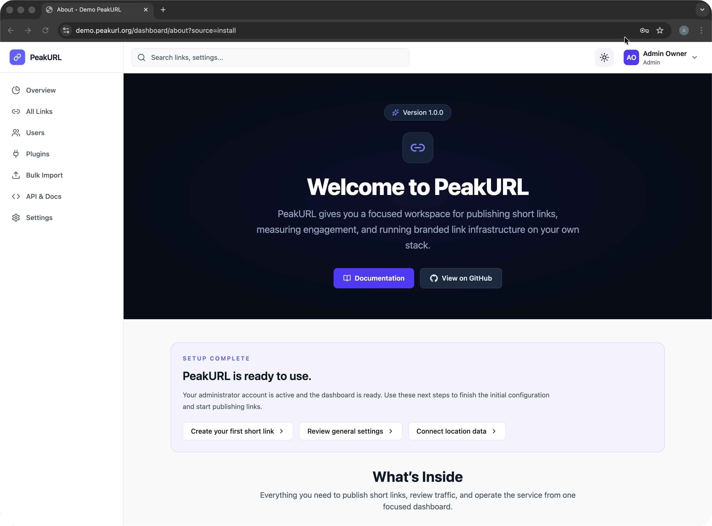
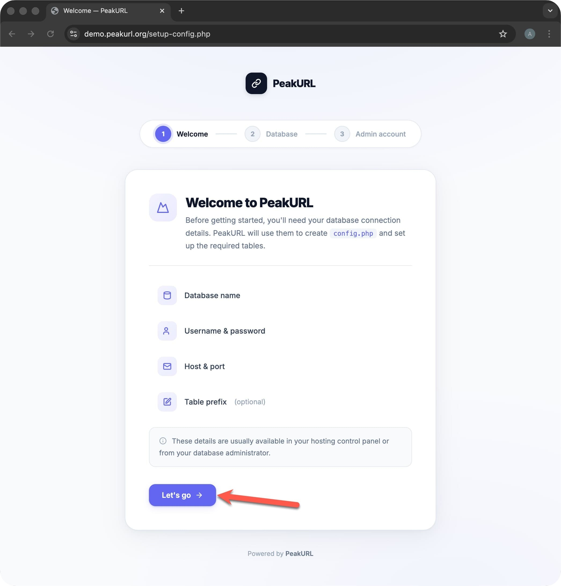
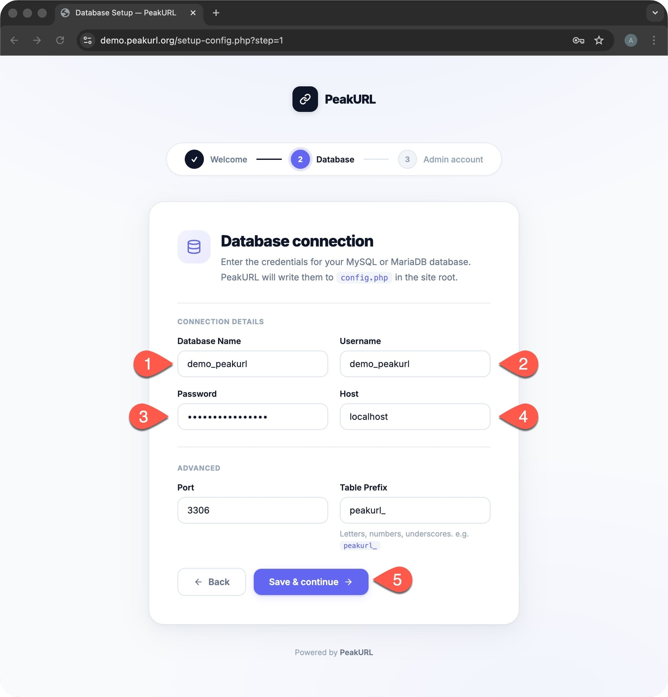
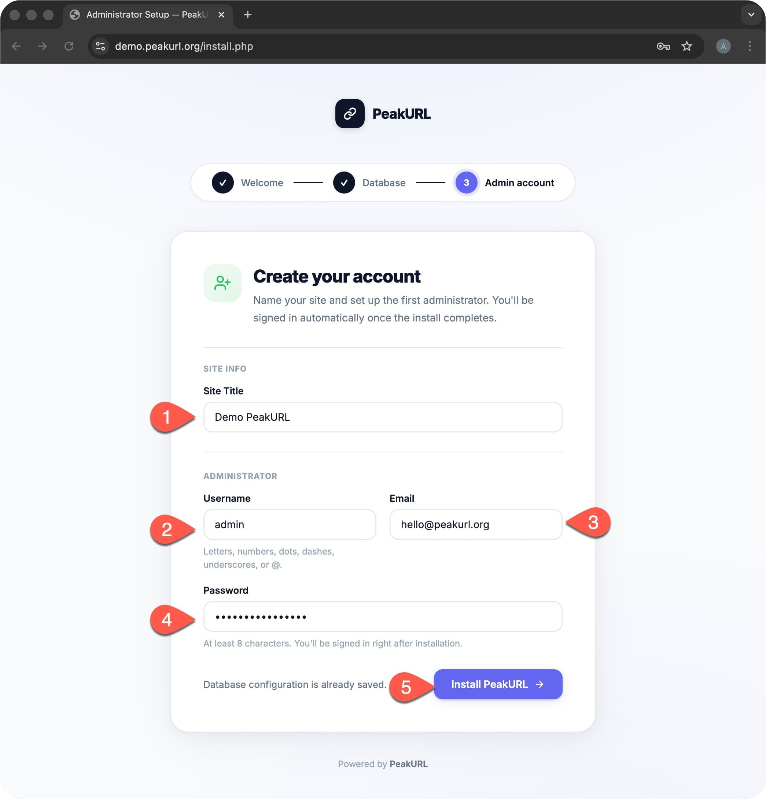

# PeakURL

PeakURL is an open-source, self-hosted link management platform for teams and businesses that want full control over branded short links, analytics, and dashboard access on their own infrastructure.

It is built for a straightforward self-hosted experience: install it on your domain, complete the browser-based setup, and manage everything from a clean dashboard.

## Why PeakURL

- Branded short links managed from a dedicated dashboard
- Link analytics for clicks, visitors, devices, referrers, and locations
- Password-protected and time-based links
- Direct site users with `admin` and `editor` roles
- API access, webhooks, and a self-hosted release workflow
- A browser-based installer designed for shared hosting and VPS environments

## Getting Started

PeakURL is designed to be installed through its built-in web installer.

If you want the fastest path to a working install:

1. Download the latest release from [peakurl.org/latest.zip](https://peakurl.org/latest.zip)
2. Extract it on your domain or subdirectory
3. Visit your site root in the browser
4. Complete the three-step installer
5. Sign in and start creating links

For installation, setup, usage, and product documentation, start here:

- [PeakURL.org Docs](https://peakurl.org/docs)

If you are migrating from YOURLS, you can export your links with the
[`YOURLS to PeakURL` plugin](https://github.com/PeakURL/YOURLS-to-PeakURL)
and then import them from the PeakURL dashboard through `Bulk Import`.

## Installation

PeakURL is built to feel familiar on shared hosting, VPS setups, and standard
PHP environments. You do not need a separate control panel application or a
complex deploy process to get started.

### 1. Start the installer

Upload the latest release to your site, then visit your site root in the
browser. PeakURL detects a fresh install automatically, opens the installer,
and tells you exactly what it needs before it writes your `config.php`.

The first screen keeps things simple:

- database name
- database username and password
- database host and port
- optional table prefix
- one clear **Let's go** action to start the setup

### 2. Connect your database

Enter your MySQL or MariaDB details and continue. PeakURL writes the bootstrap
configuration for you and prepares the install for the final setup step.

This step is designed for real-world hosting environments, so it works well
whether your database is local, remote, or managed through a hosting panel.

The numbered markers in the screenshot map to:

1. **Database name**: the MySQL or MariaDB database PeakURL will use.
2. **Username**: the database user with access to that database.
3. **Password**: the password for that database user.
4. **Host**: usually `localhost`, unless your host gives you a remote DB host.
5. **Save & continue**: writes the runtime config and moves you into the final setup step.

### 3. Create the first administrator

Once the database is connected, choose your site title and create the first
administrator account. PeakURL signs you in immediately after installation, so
you can move straight into the dashboard.

You only need to set:

- site title
- admin username
- admin email
- admin password

The numbered markers in the screenshot map to:

1. **Site title**: the name shown across the dashboard and product screens.
2. **Username**: the first administrator login name.
3. **Email**: the recovery and notification address for that first admin account.
4. **Password**: the administrator password for the new install.
5. **Install PeakURL**: creates the tables, saves the site settings, and signs you in.

### 4. Start using PeakURL

After installation, you land in a focused dashboard built for publishing
links, reviewing traffic, and managing settings without SaaS clutter.

From there you can:

- create your first short link
- review analytics and visitor insights
- import existing links
- manage users, API access, and integrations
- configure email delivery, updates, and location data

If you want the latest public install package, use
[peakurl.org/latest.zip](https://peakurl.org/latest.zip).

## Open Source

PeakURL is released under the [MIT License](LICENSE).

The project is intended to stay practical, readable, and self-hostable.

## Support the Project

If you use PeakURL in production, client work, or internal tooling, sponsorship helps support ongoing maintenance, releases, documentation, and long-term development.

## Contributing

Contributions are welcome.

Before opening a pull request, please read:

- [Contributing Guide](CONTRIBUTING.md)
- [Code of Conduct](CODE_OF_CONDUCT.md)
- [Security Policy](SECURITY.md)
- [Development Environment Setup](docs/dev/DEVELOPMENT.md)
- [Linting and Formatting](docs/dev/LINTING.md)
