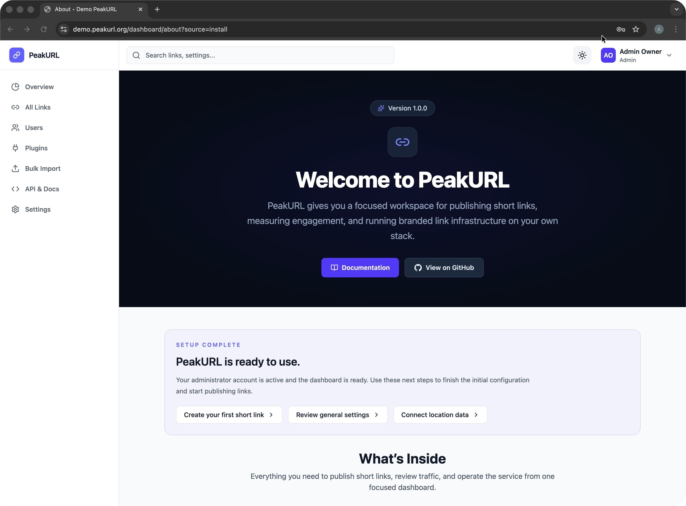
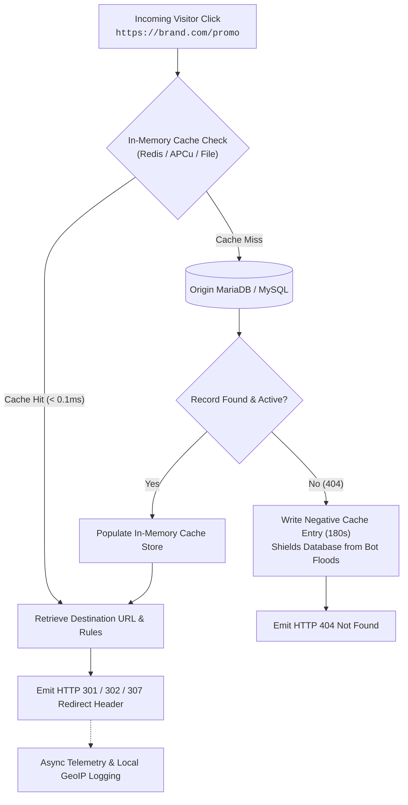
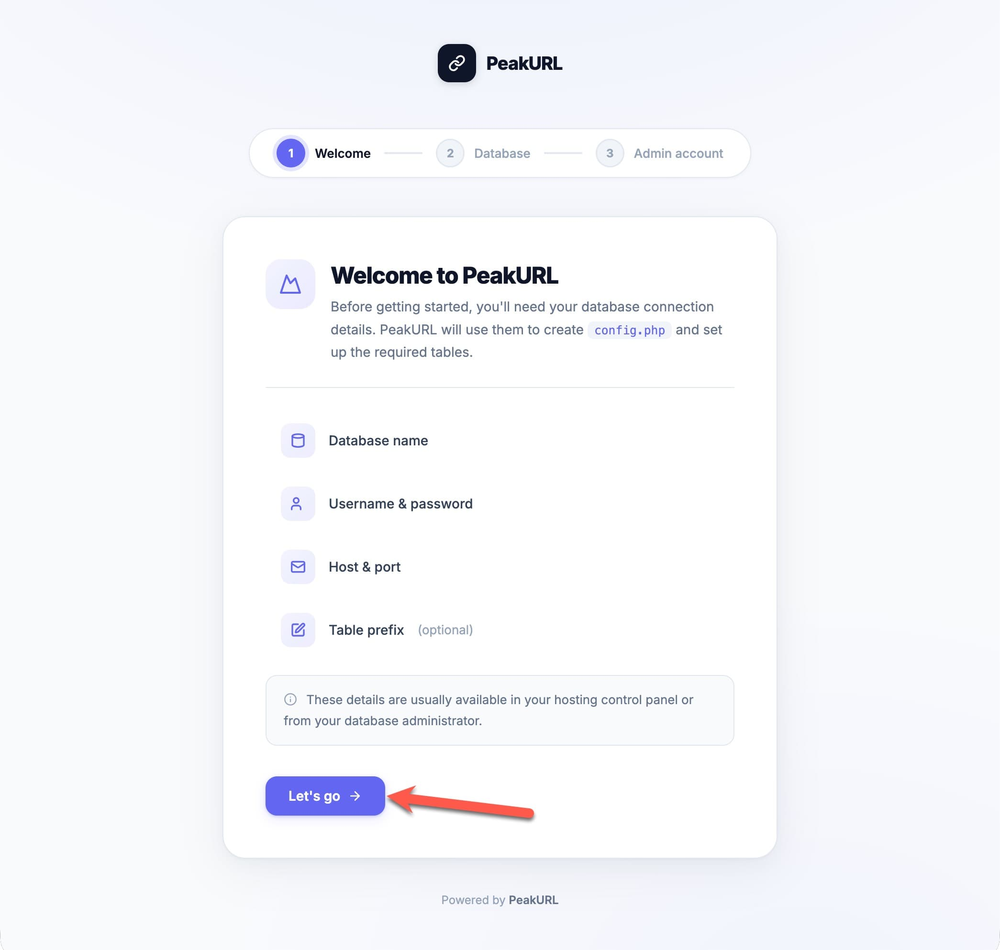
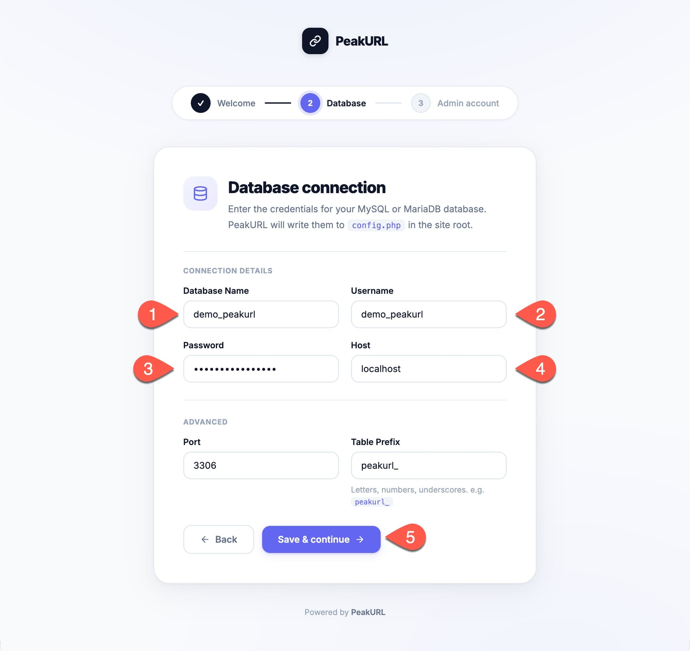
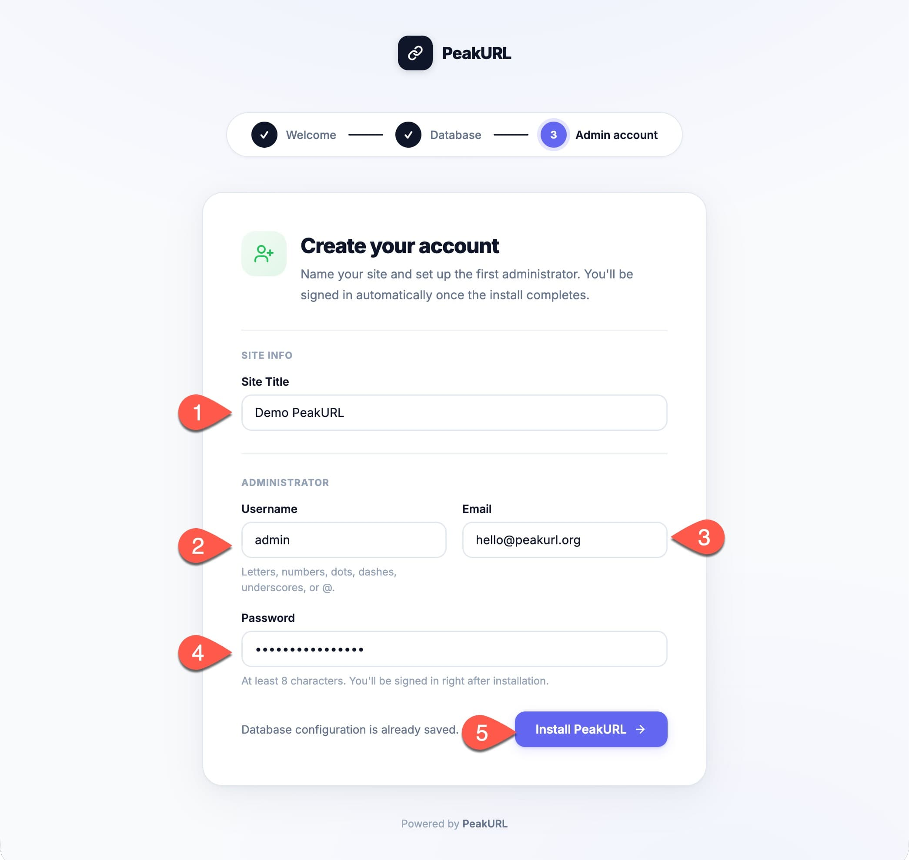
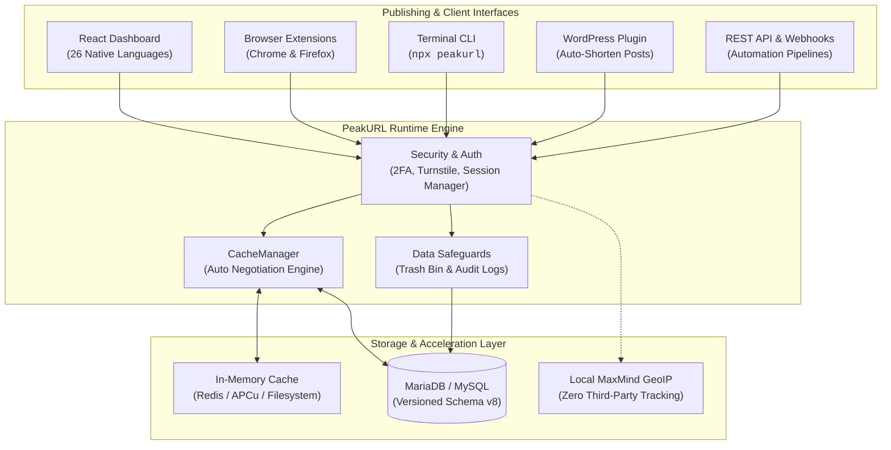

# PeakURL

[](https://github.com/PeakURL/PeakURL/actions/workflows/release-r2.yml)
[](https://github.com/PeakURL/containers/actions/workflows/publish-image.yml)
[](https://github.com/PeakURL/CLI/actions/workflows/publish.yml)
[](https://hub.docker.com/r/peakurl/peakurl)
[](https://www.npmjs.com/package/peakurl)
[](https://wordpress.org/plugins/peakurl/)
[](https://chromewebstore.google.com/detail/peakurl/bjnaehckdlmehelmlgikjbojbdcanimg)
[](https://addons.mozilla.org/en-US/firefox/addon/peakurl/)

**PeakURL** is an open-source, self-hosted link management platform and URL shortener designed for teams, businesses, and developers who want complete ownership over their branded short links, click analytics, and custom domains without recurring SaaS fees or vendor lock-in.

Built with a modern React dashboard, a high-throughput in-memory caching engine (Redis & APCu), and a lean PHP 8 runtime, PeakURL serves as a fast, private, self-hosted alternative to Bitly, Dub, and YOURLS.



## Why PeakURL

- **Branded Short Links**: Create custom, memorable short URLs with customized slugs, titles, and social share metadata.
- **Microsecond Redirection**: Multi-tier in-memory caching with Redis, APCu, and Filesystem drivers delivering redirects in `< 0.1ms`.
- **Data Safeguards & Trash Protection**: Built-in soft-delete safety net with configurable retention windows (14–90 days or indefinite) and 1-click link restoration.
- **Chronological Activity & Audit Logging**: Searchable audit trail logging administrative link updates, status toggles, user logins, and security events.
- **One-Click In-App Updates**: Effortless maintenance with automated SHA-256 release checksum verification and hands-free database migrations.
- **Privacy-First Local GeoIP Analytics**: Local MaxMind GeoLite2 City resolution for countries, cities, and regions with zero third-party tracking.
- **Detailed Click Analytics**: Track total clicks, unique visitors, referrers, devices, operating systems, and browsers in real time.
- **Comprehensive Security & 2FA**: Two-factor authentication (TOTP), Cloudflare Turnstile & Google reCAPTCHA v3 bot defense, and hashed secrets.
- **Global Localization**: Native multi-language dashboard translated into [26 languages](https://go.peakurl.org/p1855) with full bidirectional (LTR & RTL) support.
- **Site Health & Diagnostics**: Real-time diagnostic dashboard monitoring PHP environment, database status, cache hit-rates, and directory write permissions.
- **Flexible Root Domain Routing**: Configure your homepage to display a customizable landing page, redirect to a marketing URL, or show the login screen.
- **Developer-Ready API & Webhooks**: Clean RESTful endpoints, scoped API keys, real-time webhook event dispatching, and terminal CLI automation.
- **Seamless Bulk Import & Portability**: Animated progress tracking for bulk uploads, 1-click YOURLS migration, and full CSV/JSON/XML data export.

### Why Self-Host PeakURL?

| Feature                      | PeakURL (Self-Hosted)                                                               | Commercial SaaS (Bitly, Dub, Rebrandly)                             | Legacy PHP Scripts (YOURLS)           |
| :--------------------------- | :---------------------------------------------------------------------------------- | :------------------------------------------------------------------ | :------------------------------------ |
| **Pricing & Limits**         | **100% Free & Open Source (Unlimited Clicks & Links)**                              | High monthly subscriptions, paywalled custom domains & click limits | Free                                  |
| **Data Privacy & Ownership** | **100% Private (Your server, database, and telemetry)**                             | Third-party tracking, vendor lock-in, external compliance risks     | Self-hosted                           |
| **Redirection Latency**      | **Sub-millisecond (< 0.1ms)** with Redis & APCu in-memory caching                   | Cloud network latency & shared edge queues                          | Relational DB query on every click    |
| **Data Safeguards & Trash**  | **Built-in Trash retention (14–90d) & 1-click audit restoration**                   | Varies / permanent drops on lower tiers                             | Immediate permanent deletion          |
| **Maintenance & Updates**    | **1-Click in-app updates with automated DB schema migrations**                      | Managed cloud infrastructure                                        | Manual FTP file uploads & SQL scripts |
| **Activity & Audit Logging** | **Searchable chronological audit trail with exact user attribution**                | Enterprise tiers only                                               | None                                  |
| **Bot & Abuse Prevention**   | **Cloudflare Turnstile & Google reCAPTCHA v3 built-in**                             | Included only in higher tiers                                       | Requires third-party plugins          |
| **Official Ecosystem**       | **CLI, WordPress Plugin, Chrome & Firefox Extensions, Docker**                      | Varies by provider / closed API limits                              | Community plugins only                |
| **User Roles & Security**    | **Direct `admin` & `editor` roles, 2FA (TOTP), API keys**                           | Included only in expensive enterprise tiers                         | Basic single-user auth                |
| **Internationalization**     | **[26 Native Languages](https://go.peakurl.org/p1855) with full LTR & RTL layouts** | English-only or limited languages                                   | Limited translation files             |

## Performance & Caching

PeakURL includes a built-in, multi-tier caching engine that keeps link redirects fast and your database protected — even during traffic spikes.

Instead of querying the database on every click, PeakURL resolves short links from in-memory cache in **under 0.1 milliseconds**. The database is only touched once to warm the cache; every subsequent redirect is served straight from memory.


```mermaid
flowchart TD
    Req["Incoming Visitor Click<br/><code>https://brand.com/promo</code>"] --> Cache{"In-Memory Cache Check<br/>(Redis / APCu / File)"}

    Cache -- "Cache Hit (< 0.1ms)" --> FastPath["Retrieve Destination URL &amp; Rules"]
    FastPath --> Redir["Emit HTTP 301 / 302 / 307 Redirect Header"]
    Redir -.-> Async["Async Telemetry &amp; Local GeoIP Logging"]

    Cache -- "Cache Miss" --> DB[("Origin MariaDB / MySQL")]
    DB --> Found{"Record Found &amp; Active?"}

    Found -- "Yes" --> Warm["Populate In-Memory Cache Store"]
    Warm --> FastPath

    Found -- "No (404)" --> NegCache["Write Negative Cache Entry (180s)<br/>Shields Database from Bot Floods"]
    NegCache --> NotFound["Emit HTTP 404 Not Found"]
```

### Cache Drivers

PeakURL ships with four cache drivers that cover everything from budget shared hosting to enterprise-scale clusters:

| Driver              | Best For                                          | Retrieval Latency |
| :------------------ | :------------------------------------------------ | :---------------- |
| **Redis**           | Production VPS, containers, multi-server clusters | ~ 0.09 ms         |
| **APCu**            | Single-server VPS and dedicated PHP-FPM hosts     | ~ 0.05 ms         |
| **Filesystem**      | Shared hosting and cPanel environments            | ~ 0.18 ms         |
| **Direct Database** | Local development and debugging                   | ~ 0.27 ms         |

When set to `Automatic` (the default), PeakURL selects the fastest available driver on your server. If a preferred driver becomes unavailable at runtime, PeakURL falls back through the hierarchy automatically.

### Benchmark Highlights

Stress-tested with [Grafana k6](https://k6.io/) across thousands of seeded links on a standard cloud VPS:

- **100% redirect success rate** — zero dropped requests under sustained concurrent load
- **Redis retrieval is ~3x faster** than direct database reads
- **Peak throughput exceeds 8,000 requests/second** with Redis enabled
- **100% of database read traffic offloaded** — the origin database stays idle during redirect serving

### Memory Footprint

PeakURL's caching layer is designed to stay lean:

| Active Links | Redis RAM | APCu RAM | Filesystem Disk |
| :----------- | :-------- | :------- | :-------------- |
| 1,000        | ~ 1.4 MB  | ~ 0.4 MB | ~ 0.3 MB        |
| 10,000       | ~ 4.5 MB  | ~ 3.8 MB | ~ 3.0 MB        |
| 100,000      | ~ 35 MB   | ~ 34 MB  | ~ 28 MB         |
| 1,000,000    | ~ 320 MB  | ~ 310 MB | ~ 260 MB        |

A standard 1 GB VPS can comfortably cache over **one million active short links** in Redis with room to spare for PHP, the web server, and the database.

### Additional Cache Features

- **Negative caching** shields the database from 404 bot-scanning floods
- **Instant invalidation** on link updates, deletions, and bulk operations — no stale redirects
- **Dashboard management** through `Settings → Performance` with one-click cache purge
- **System status monitoring** through `Tools → System Status` with live driver health, memory footprint, and hit-rate metrics

Cache configuration can be managed entirely from the dashboard under `Settings → Performance` or through environment variables. For the full architectural deep-dive, see [High-Throughput Link Redirection: Inside the PeakURL Caching Engine](https://go.peakurl.org/p1934).

## Administrative & Operational Safeguards

Self-hosting should never mean compromising on reliability, security, or maintenance ease. PeakURL is engineered with enterprise-grade operational safeguards designed to keep your infrastructure secure, your data protected, and your administrative overhead minimal:

### 1. Zero-Friction One-Click Updates

Maintaining a self-hosted platform should never feel like a chore. PeakURL eliminates manual FTP uploads, risky manual SQL migrations, and terminal commands:

- **In-App Dashboard Updater**: Check for new releases and apply updates with a single click from `Settings → Updates`.
- **SHA-256 Checksum Verification**: Every package is cryptographically verified against official release hashes before unpacking to ensure file integrity.
- **Automated Database Migrations**: Schema upgrades are versioned and executed automatically during first boot with zero manual SQL intervention.

### 2. Data Safeguards & Trash Protection

Accidental deletions can break marketing campaigns, documentation links, and active QR codes. PeakURL provides a built-in safety net:

- **Soft-Delete Trash Bin**: Deleted links are placed in a dedicated Trash repository rather than being permanently removed from the database.
- **Configurable Auto-Purge**: Set retention windows between 14 to 90 days, or retain trashed links indefinitely based on your compliance policy.
- **One-Click Restoration**: Restore any link instantly with all historic click metrics, custom aliases, and targeting rules fully intact.
- **Relational Integrity Safeguards**: Database foreign keys use `ON DELETE SET NULL` to preserve historical audit records and prevent corrupted analytics.

### 3. Chronological Activity & Audit Trail

Ensure full operational accountability with a transparent, searchable event log (`Dashboard → Activity`):

- **Granular Mutation Logs**: Records every link creation, destination change, custom alias modification, and status toggle.
- **Security & Session Audits**: Tracks administrative sign-ins, remote session revocations, password updates, and API key generation.
- **Contextual Attribution**: Every log entry captures the exact timestamp, actor username, IP address, and changed parameters.

### 4. Real-Time Site Health & Environmental Diagnostics

Proactively monitor server performance and identify potential bottlenecks from the diagnostic dashboard (`Tools → System Status`):

- **Runtime Environment**: Verifies PHP version, Zend OPcache acceleration, and active PHP extensions.
- **Database & Cache Health**: Reports active database connection status, table prefix details, and Redis/APCu hit rates and memory usage.
- **Storage & GeoIP Freshness**: Confirms directory write permissions and tracks the currency of your local MaxMind GeoLite2 City database.

### 5. Authentication Hardening & Abuse Defense

- **Two-Factor Authentication (TOTP)**: Secure admin and editor accounts using standard authenticator apps (Google Authenticator, 1Password, Bitwarden) with emergency backup recovery codes.
- **Automated Bot Prevention**: Defend public login and password recovery forms with native Cloudflare Turnstile and Google reCAPTCHA v3.
- **Active Session Management**: Inspect connected browser sessions with device icons and revoke unrecognized sessions remotely.
- **Hashed Secrets at Rest**: Passwords, API keys, and link passwords are cryptographically hashed; secret values are never exposed or stored in plaintext.

## Getting Started

PeakURL is designed to be installed through its built-in web installer.

If you want the fastest path to a working install:

1. Download the latest release from [PeakURL.org/download](https://peakurl.org/download)
2. Extract it on your domain or subdirectory
3. Visit your site root in the browser
4. Complete the three-step installer
5. Sign in and start creating links

For installation, setup, usage, and product documentation, start here:

- [PeakURL.org Docs](https://peakurl.org/docs)
- [Full Setup Tutorial (Video)](https://youtu.be/Xal8Qp5VPrc)

If you are migrating from YOURLS, you can export your links with the
[`YOURLS to PeakURL` plugin](https://github.com/PeakURL/YOURLS-to-PeakURL)
and then import them from the PeakURL dashboard through `Bulk Import`.

## Installation

PeakURL is built to feel familiar on shared hosting, VPS setups, and standard
PHP environments. You do not need a separate control panel application or a
complex deploy process to get started.

### 1. Start the installer

Upload the latest release to your site, then visit your site root in the
browser. PeakURL detects a fresh install automatically, opens the installer,
and tells you exactly what it needs before it writes your `config.php`.



The first screen keeps things simple:

- database name
- database username and password
- database host and port
- optional table prefix
- one clear **Let's go** action to start the setup

### 2. Connect your database

Enter your MySQL or MariaDB details and continue. PeakURL writes the bootstrap
configuration for you and prepares the install for the final setup step.



This step is designed for real-world hosting environments, so it works well
whether your database is local, remote, or managed through a hosting panel.

The numbered markers in the screenshot map to:

1. **Database name**: the MySQL or MariaDB database PeakURL will use.
2. **Username**: the database user with access to that database.
3. **Password**: the password for that database user.
4. **Host**: usually `localhost`, unless your host gives you a remote DB host.
5. **Save & continue**: writes the runtime config and moves you into the final setup step.

### 3. Create the first administrator

Once the database is connected, choose your site title and create the first
administrator account. PeakURL signs you in immediately after installation, so
you can move straight into the dashboard.



You only need to set:

- site title
- admin username
- admin email
- admin password

The numbered markers in the screenshot map to:

1. **Site title**: the name shown across the dashboard and product screens.
2. **Username**: the first administrator login name.
3. **Email**: the recovery and notification address for that first admin account.
4. **Password**: the administrator password for the new install.
5. **Install PeakURL**: creates the tables, saves the site settings, and signs you in.

### 4. Start using PeakURL

After installation, you land in a focused dashboard built for publishing
links, reviewing traffic, and managing settings without SaaS clutter.


Dashboard highlights include:

- short-link publishing and bulk import tools
- analytics for traffic, devices, referrers, and locations
- multi-language dashboard localized in [26 languages](https://go.peakurl.org/p1855) with full RTL/LTR support
- user, session, API-key, and integration management
- self-hosted operations for settings, mail delivery, updates, and location data

For the full product guide and current feature details, visit
[peakurl.org/docs](https://peakurl.org/docs).

If you want the latest public install package, use
[peakurl.org/latest.zip](https://peakurl.org/latest.zip).

### Alternative: Docker Deployment

If you prefer running PeakURL in a containerized environment, official production-ready images are published on Docker Hub and GitHub Packages:

```bash
docker run -d \
  --name peakurl \
  -p 80:80 \
  -e DB_HOST=your-db-host \
  -e DB_NAME=peakurl \
  -e DB_USER=peakurl \
  -e DB_PASSWORD=your-secret-password \
  peakurl/peakurl:latest
```

For a complete production stack configured with Redis and MariaDB via Docker Compose, read the full tutorial: [Run PeakURL with Docker: A Guide to Self-Hosting Your URL Shortener](https://go.peakurl.org/p1920).

## Official Ecosystem & Tools

PeakURL extends beyond the web dashboard with an official suite of tools, integrations, and extensions designed to streamline link creation, browser productivity, and developer automation:


```mermaid
flowchart TD
    subgraph Clients["Publishing & Client Interfaces"]
        Web["React Dashboard<br/>(26 Native Languages)"]
        Ext["Browser Extensions<br/>(Chrome &amp; Firefox)"]
        CLI["Terminal CLI<br/>(<code>npx peakurl</code>)"]
        WP["WordPress Plugin<br/>(Auto-Shorten Posts)"]
        API["REST API &amp; Webhooks<br/>(Automation Pipelines)"]
    end

    subgraph Core["PeakURL Runtime Engine"]
        Security["Security &amp; Auth<br/>(2FA, Turnstile, Session Manager)"]
        CacheMgr["CacheManager<br/>(Auto Negotiation Engine)"]
        Safeguards["Data Safeguards<br/>(Trash Bin &amp; Audit Logs)"]
    end

    subgraph Storage["Storage &amp; Acceleration Layer"]
        Cache["In-Memory Cache<br/>(Redis / APCu / Filesystem)"]
        Database[("MariaDB / MySQL<br/>(Versioned Schema v8)")]
        GeoIP["Local MaxMind GeoIP<br/>(Zero Third-Party Tracking)"]
    end

    Web & Ext & CLI & WP & API --> Security
    Security --> CacheMgr
    Security --> Safeguards
    CacheMgr <--> Cache
    CacheMgr <--> Database
    Safeguards --> Database
    Security -.-> GeoIP
```

- **[Browser Extensions for Chrome & Firefox](https://go.peakurl.org/p1923)**: Create custom branded short links, customize aliases, and generate QR codes in one click directly from your browser toolbar. Available on the [Chrome Web Store](https://go.peakurl.org/get-chrome-extension) and [Firefox Add-ons](https://go.peakurl.org/get-firefox-addon).
- **[PeakURL Command-Line Interface (CLI)](https://go.peakurl.org/p1894)**: Create and manage short links, inspect analytics, and automate shortening workflows directly from your terminal or CI/CD pipelines (`npx peakurl` or `npm i -g peakurl`).
- **[PeakURL for WordPress Plugin](https://go.peakurl.org/p1800)**: Automatically generate branded short links for posts, pages, and custom post types directly within your WordPress publishing workflow. Available on [WordPress.org](https://go.peakurl.org/get-wordpress-plugin).
- **[Official Docker Containers](https://go.peakurl.org/p1920)**: Launch containerized PeakURL instances with Redis and MariaDB in seconds using pre-built Docker and Docker Compose images.
- **[Global Multi-Language Support](https://go.peakurl.org/p1855)**: Fully localized across 26 languages with native bidirectional (LTR & RTL) layout rendering for global teams.

## Technical Guides & Architecture Deep Dives

Explore our in-depth engineering breakdowns, deployment walkthroughs, and operational guides from the [PeakURL Blog](https://peakurl.org/blog):

| Guide / Architecture Article                                                                                     | Focus Area            | Overview                                                                                                                                                   |
| :--------------------------------------------------------------------------------------------------------------- | :-------------------- | :--------------------------------------------------------------------------------------------------------------------------------------------------------- |
| **[High-Throughput Link Redirection: Inside the PeakURL Caching Engine](https://go.peakurl.org/p1934)**          | Caching & Performance | Architectural deep-dive into multi-tier Redis and APCu caching, sub-millisecond redirect benchmarks, and negative caching against 404 bot stampedes.       |
| **[Run PeakURL with Docker: A Guide to Self-Hosting Your URL Shortener](https://go.peakurl.org/p1920)**          | Container Deployment  | Step-by-step tutorial on containerized deployment, configuring Redis & MariaDB with Docker Compose, and managing persistent volumes.                       |
| **[PeakURL Extensions: Create Short Links in Chrome & Firefox](https://go.peakurl.org/p1923)**                   | Browser Productivity  | Comprehensive setup and feature guide for the official browser extensions, enabling one-click link shortening and QR code generation.                      |
| **[PeakURL CLI: Supercharge Your Link Management & Automation from the Terminal](https://go.peakurl.org/p1894)** | Developer Automation  | Complete CLI guide covering terminal-based link creation, JSON output parsing, and integrating PeakURL into CI/CD pipelines.                               |
| **[How to Use PeakURL for WordPress: Complete Setup and URL Shortening Guide](https://go.peakurl.org/p1800)**    | CMS Integration       | Step-by-step walkthrough on integrating the official WordPress plugin to automatically shorten URLs for published posts and pages on your branded domain.  |
| **[PeakURL Is Now Available in 26 Languages](https://go.peakurl.org/p1855)**                                     | Internationalization  | Overview of PeakURL's localization infrastructure, supporting 26 native languages, bidirectional (LTR/RTL) rendering, and community translation workflows. |

## Open Source

PeakURL is released under the [MIT License](LICENSE).

The project is intended to stay practical, readable, and self-hostable.

## Support the Project

If you use PeakURL in production, client work, or internal tooling, sponsorship helps support ongoing maintenance, releases, documentation, and long-term development.

[Become a sponsor](https://peakurl.org/sponsor) to claim your spot on the homepage and GitHub repository!

### Wall of Love

A huge thank you to everyone who has contributed to keeping PeakURL running.

#### Creator & Maintainer

- **Abd Ur Rehman** - [Independent Solo Maintainer](https://go.peakurl.org/author)

#### Company Sponsors

Help keep PeakURL actively maintained and free for everyone. [Become a sponsor](https://peakurl.org/sponsor) to feature your company's logo here and on the homepage.

#### Community Supporters

- [Abdellah Chelli](https://github.com/sneetsher)

[Buy Me a Coffee](https://buymeacoffee.com/PeakURL) to join the community supporters.

## Contributing

Contributions are welcome.

Before opening a pull request, please read:

- [Contributing Guide](CONTRIBUTING.md)
- [Code of Conduct](CODE_OF_CONDUCT.md)
- [Security Policy](SECURITY.md)
- [Development Environment Setup](docs/dev/DEVELOPMENT.md)
- [Linting and Formatting](docs/dev/LINTING.md)
- [TypeScript Guide](docs/dev/TYPESCRIPT.md)
